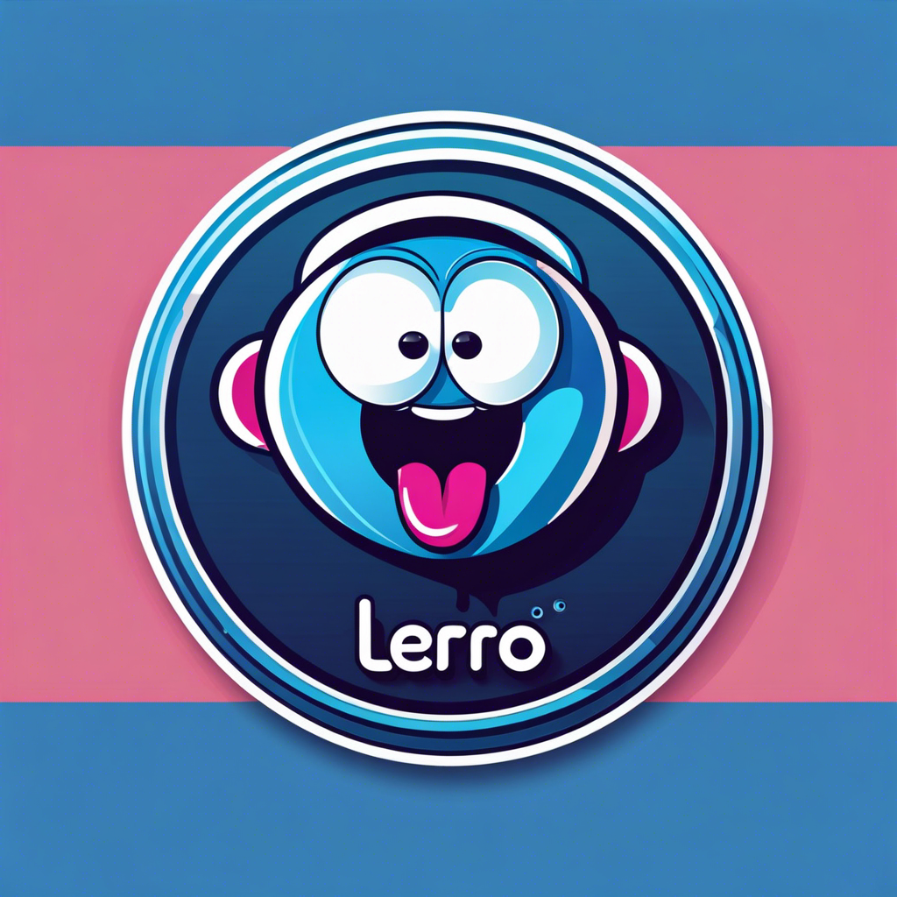

<p align="center">

</p>

# Lero Lero Generator 🤖💬

Welcome to the Lero Lero Generator! This TypeScript-based project leverages the power of OpenAI's GPT-3 to generate text in response to prompts. Additionally, it offers a feature to store history, creating a chat-like experience. With the integration of Discord.js, you can seamlessly interact with the generated content through Discord. AWS S3 is utilized for storing message history, ensuring efficient data management.

> [!IMPORTANT]
> Please note that this project is developed for educational purposes. While it demonstrates the capabilities of text generation and history storage, it is not intended for production use.

## Usage 🚀

### Installation

To get started, ensure you have Node.js and `pnpm` installed:

```bash
pnpm install
```

### Configuration

Set up your environment variables, including API keys for OpenAI GPT-3 and AWS S3:

```bash
cp .env.example .env
```

Fill in the necessary values in the `.env` file.

### Running the Project

Running the discord bot app:

```bash
pnpm run:disc
```

## Features 🎯

- **Text Generation**: Utilize GPT-3 to generate text based on user prompts.
- **Chat-like Interface**: Maintain a history of prompts and responses, creating a conversational experience.
- **Discord Integration**: Interact with the generator seamlessly through Discord commands.
- **AWS S3 Integration**: Store and manage message history efficiently using AWS S3.

## Project Structure 📁

The project structure is organized as follows:

```
├── src/
│   ├── apps/
│       └── discord/
│   └── packages/
|       ├── history/
|       ├── generation/
│       └── lerolero/
├── .env.example
├── package.json
├── tsconfig.json
└── README.md
```

### Packages 📦
The `packages` folder contains reusable modules or libraries designed for specific tasks. These independent components offer cohesive functionalities that can be used across different parts of the project or even in other projects.

### Apps 🚀
The `apps` folder hosts the project's main applications or services. Each app represents a distinct aspect of the project and utilizes the modules from `packages` to deliver specific functionalities or user-facing features.

## Contribution Guidelines 🤝

Contributions are welcome! Please ensure to follow these guidelines:

- Fork the repository and create your branch from `main`.
- Ensure your code adheres to TypeScript and Discord.js style guides.
- Open a pull request detailing the changes made and the problem solved.

## Tools

- [OpenAI GPT-3](https://openai.com/)
- [Discord.js](https://discord.js.org/)
- [AWS SDK for JavaScript](https://aws.amazon.com/sdk-for-javascript/)

<p align="center">

</p>

## Contact 📧

For any queries or suggestions, feel free to reach out:


<br>

<p align="center">
<a href="https://www.linkedin.com/in/luis-felipe-vanin-martins-5a5b38215">

</a>
<a href="mailto:luisfvanin2@gmail.com">

</a>


